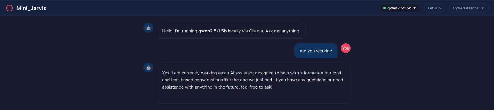

# MiniJarvis: Local LLM One-Click Deploy

<p align="center">
  
</p>

**Your own private AI — running locally, no cloud required.**

Ollama-in-a-Box gives anyone a dead-simple way to spin up a local Large Language Model on a VM and chat with it through a web interface. No API keys, no subscriptions, no data leaving your machine. Just you and an your super-special LLM!

---

## Quick Start

### Prerequisites

- An **Ubuntu** VM (or similar Debian-based distro)
- **Docker** installed — if it isn't, the setup script will let you know and point you to an easy one-liner

### 1. Run the Setup Script

```bash
chmod +x setup.sh
sudo ./setup.sh
```

The script will:
1. Check that Docker is available (and suggest `sudo apt install docker.io -y` if it isn't)
2. Pull and launch the **Ollama** container
3. Download the **llama3.2:1b** model (~1 GB)
4. Build and launch the **Chat Web UI** container

### 2. Start Chatting

Once the script finishes, open your browser and navigate to:

```
http://localhost:8888
```

You'll see a ChatGPT-style interface where you can type prompts and get responses from your locally-hosted LLM. That's it — no accounts, no cloud, just local AI.

---

## 📁 Project Structure

```
.
├── setup.sh            # One-command Ollama + model deployment
├── web/
│   ├── index.html      # Chat UI (dark theme, async, spinner)
│   ├── nginx.conf      # Reverse proxy config (routes API to Ollama)
│   └── Dockerfile      # Lightweight nginx:alpine container
└── README.md
```

---

## 🛑 Stopping Everything

```bash
sudo docker stop ollama-chat ollama
sudo docker rm ollama-chat ollama
```

---

## License

Do whatever you want with it. It's your box.
