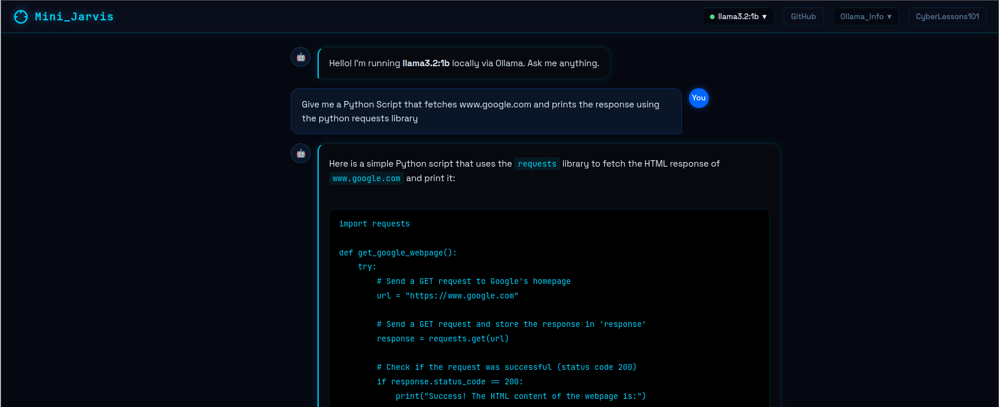

# MiniJarvis: Dockerized Local LLM Chat App
<p align="center">
  
</p>

**Your own private AI — running locally, no cloud required.**

Ollama-in-a-Box gives anyone a dead-simple way to spin up a local Large Language Model on a VM and chat with it through a web interface. No API keys, no subscriptions, no data leaving your machine. Just you and an your super-special LLM!

---
### Resource Links

Below is the link to the lesson plan.

* [Click Here for the Lesson Plan](https://www.notion.so/Introducing-LLMs-at-the-6-12-Grade-Levels-MiniJarvis-3174c8e523768022b7daf704a7d2f9d1?source=copy_link)
### Heads Up !

**System Requirements:**
- **Ubuntu/Kali VM** with 30G-40G disk space (to be safe)
- **8G of RAM** (LLMs are memory and disk hungry!)

---

## Quick Start

### Prerequisites

-  Ubuntu/Kali VM (See Requirements Above)
- **Docker** installed — if it isn't, the setup script will let you know and point you to an easy one-liner

### 1. Run the Setup Script

```bash
chmod +x setup.sh
sudo ./setup.sh
```

The script will:
1. Check that Docker is available (and suggest `sudo apt install docker.io -y` if it isn't)
2. Pull and launch the **Ollama** container
3. Download the **llama3.2:1b** model (~1 GB) by default, but you can choose other models from a preset list or Ollama's library.
4. Build and launch the **Chat Web UI** container

### 2. Start Chatting

Once the script finishes, open your browser and navigate to:

```
http://localhost:8888
```

You'll see a ChatGPT-style interface where you can type prompts and get responses from your locally-hosted LLM. That's it — no accounts, no cloud, just local AI.

---

## 📁 Project Structure

```
.
├── setup.sh            # One-command full deployment (Ollama + model + Chat UI)
├── delete_all.sh       # Stops and removes all containers and images
├── web/
│   ├── index.html      # Chat UI (dark theme, async, model manager)
│   ├── nginx.conf      # Reverse proxy config (routes API to Ollama)
│   └── Dockerfile      # Lightweight nginx:alpine container
├── image/              # Screenshots used in README
└── README.md
```

---

## 🛑 Tearing Down / Cleanup

A cleanup script is included to stop and remove all MiniJarvis containers and images in one step:

```bash
sudo ./delete_all.sh
```

This will:
1. Stop and remove the `ollama-chat` (web UI) container
2. Stop and remove the `ollama` container
3. Delete the `ollama-chat-ui` image
4. Delete the `ollama/ollama` image

After running, you can do a clean re-deploy at any time simply by running `sudo ./setup.sh` again.

---

## License

Do whatever you want with it. It's your box.
